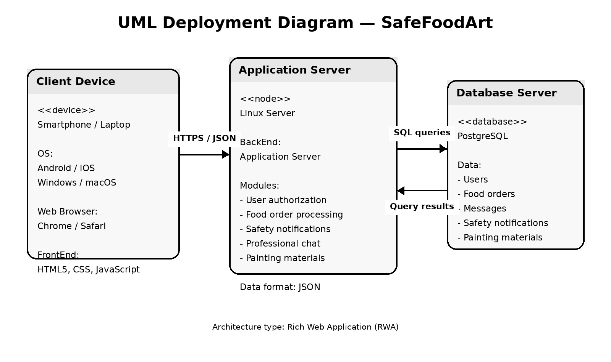

### Концептуальний опис архітектури програмного продукту

Тип архітектури програмного продукту – Rich Web Application (RWA).

Програмний продукт складається з:

- FrontEnd-рівня:
  - WEB-браузер;
  - графічний інтерфейс користувача;
  - HTML5/CSS/JavaScript;

- BackEnd-рівня:
  - сервер застосунку;
  - обробка повідомлень;
  - обробка замовлень;
  - система сповіщень;

- DataBase-рівня:
  - сервер бази даних;
  - збереження інформації про користувачів;
  - збереження повідомлень;
  - збереження замовлень;
  - збереження навчальних матеріалів.

Програмний продукт підтримує роботу через Internet та мобільні пристрої.

### PlantUML-файл

[UML-Deployment.puml](UML-Deployment.puml)
